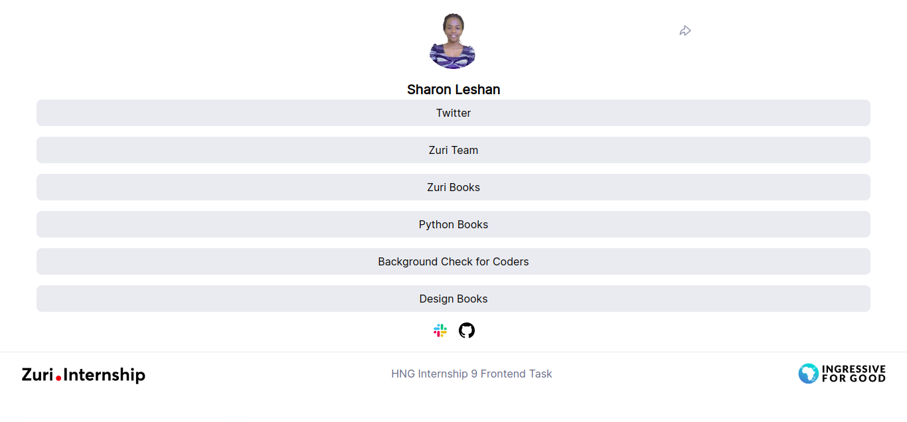

# Zuri LinkTree

Stage 1 Task

Large Screen

[](https://zuri-linktree-frontend.netlify.app/)

Mobile

[](https://zuri-linktree-frontend.netlify.app/)

## Technologies

- React
- CSS3

## Setup

```code
# Clone the repo
git clone https://github.com/sharon-leshan/zuri-linktree-frontend.git

# Navigate to directory and install packages
cd zuri-linktree-frontend && yarn

# Start the App
yarn start
```

Open the App on [`localhost:3000`](http://localhost:3000/)
